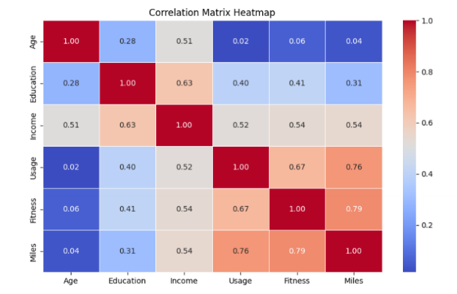

# AeroFit Treadmill Customer Profiling: Exploratory Data Analysis

## 📌 Project Overview
This project provides a data-driven deep dive into the customer base of **AeroFit**, a leading fitness equipment brand. Using Exploratory Data Analysis (EDA) in Python, we analyze the profiles of customers who purchased the **KP281**, **KP481**, and **KP781** treadmill models to optimize marketing strategies and product recommendations.

## 📂 Project Deliverables
* **[Read the Detailed EDA Report (PDF)](./reports/EDA%20Portfolio%20Project.pdf):** A comprehensive 18-page formal report containing executive summaries, statistical tables, and strategic business recommendations.
* **[Interactive Analysis (Jupyter Notebook)](notebook/Ayesha_EDA_Portfolio_Project.ipynb):** Step-by-step Python code including data cleaning, visualization, and statistical modeling.

---

## 📊 Dataset Insights
The analysis is based on **180 customer records** with 9 features covering demographics (Age, Gender, Education, Income) and behavioral data (Usage, Fitness levels, Expected Miles).

### 1. Statistical Summary
* **Average Age:** 28.8 years (Target demographic: 20–30 years).
* **Education:** Average 15.6 years (Undergraduate level).
* **Income:** Ranges from **$29,562 to $104,581**, with significant variation in the premium segment.
* **Usage:** Average frequency of ~3.5 times per week.

### 2. Product-Specific Profiles
| Feature | KP281 (Entry) | KP481 (Mid-Level) | KP781 (Premium) |
| :--- | :--- | :--- | :--- |
| **Market Share** | 44.4% | 33.3% | 22.2% |
| **Gender Split** | Equal (50/50) | Slightly more Male | Heavily Male (82.5%) |
| **Income Level** | Low to Moderate | Moderate | High ($75k+) |
| **Fitness Level** | Average (3/5) | Average (3/5) | Elite (5/5) |

---

## 📈 Key Findings & Visualizations

### Distribution & Correlations
* **Right-Skewed Trends:** Age and Income show right-skewed distributions, highlighting a younger, middle-income majority.
* **Strongest Bond:** Miles and Fitness show a **0.79 correlation**, proving that higher fitness levels directly correlate to higher usage and distance.
* **Socio-Economic Link:** Education and Income are moderately linked (**0.63**).

### Probability Analysis
* **Premium Segment:** A customer with a fitness level of 5 has a **93.55% probability** of choosing the KP781.
* **Wealth Factor:** High-income customers have a **72% probability** of purchasing the KP781.
* **Marital Influence:** **59.44%** of all customers are partnered, representing a significant market for household-focused marketing.

---

## 💡 Strategic Recommendations
1.  **Targeted Marketing:** Market the **KP281** as a versatile entry-level tool and the **KP781** as an "Elite" performance machine.
2.  **Gender-Specific Growth:** Implement campaigns to increase KP781 appeal among female customers (currently only 17.5% of premium sales).
3.  **Household Incentives:** Develop "Partner" or "Family" discount packages to leverage the high percentage of partnered users.
4.  **Advanced Segmentation:** Treat the 19 income outliers as a "High-Value" cluster for exclusive premium services.

---

## 🛠️ Tech Stack
* **Language:** Python
* **Libraries:** Pandas, NumPy, Matplotlib, Seaborn
* **Techniques:** Bivariate Analysis, Outlier Detection, Conditional Probability, Heatmaps.

## 🏁 Conclusion
While this README summarizes the key findings, the **complete technical and business analysis**—including detailed outlier treatment and conditional probability matrices—is available in the formal report.

👉 **[Read the Detailed EDA Report (PDF)](./reports/EDA%20Portfolio%20Project.pdf)**

---
**Author:** Ayesha Javaid  
**Project Date:** December 2024
